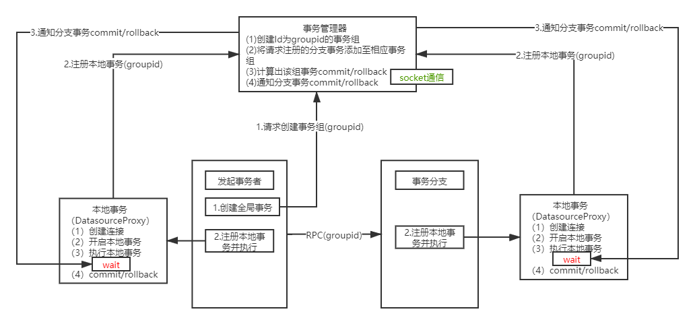

"# tx-go" 

<h3>简介</h3>

    golang编写，client、server使用socket通信，实现代理数据源在commit时wait
    ，通过事务管理器通知后实行本地事务提交或回滚。
    
<h3>简述</h3>

    1.开启全局事务，开启事务节点创建全局事务GroupId    
    2.服务见远程调用传递GroupId,本地事务携带GroupId注册至事务管理器的同一个事务组  
    3.代理Datasource执行本地事务，实现commit接口，commit前wait   
    4.事务管理器根据所有本地事务执行情况计算出所有分支事务commit/rollback     
    5.事务管理器通知分支事务commit/rollback  

<h3>逻辑架构图</h3>
